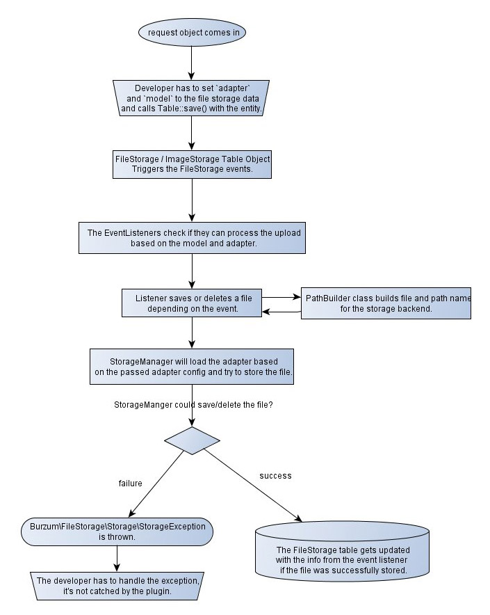

How it works
------------

The whole plugin is build with clear [Separation of Concerns](https://en.wikipedia.org/wiki/Separation_of_concerns) in mind: A file is *always* an entry in the `file_storage` table from the app perspective.

The table is the *reference* to the real place of where the file is stored and keeps some meta information like mime type, filename, file hash (optional) and size as well. You associate the `file_storage` table with your model using the FileStorage or ImageStorage model from the plugin via hasOne, hasMany or HABTM.

When you upload a file you save it to the FileStorage model through the associations, `Documents.file` for example. The FileStorage model dispatches then file storage specific events. [The listeners](../../src/Storage/Listener) listening to these events process the file and put it in the configured storage backend using adapters for different backends and build the storage path using a [path builder](Path-Builders.md) class.

